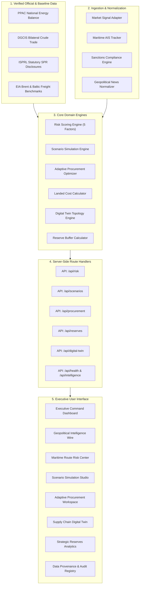

# 🛡️ EnergyShield: Accuracy-First Petroleum Security Decision-Support Platform

[](https://unstop.com)
[](https://github.com/Manisha5918/energy-resilience-intelligence)
[-059669?style=for-the-badge)](https://github.com/Manisha5918/energy-resilience-intelligence)
[](https://github.com/Manisha5918/energy-resilience-intelligence)

---

## 🏆 Hackathon & Team Details

> **🏆 Built for OOSC X GDG Hackathon 2026 (Opportunity Open Source Conference - 4.0)**  
> **Organized by**: Indian Institute of Information Technology (IIIT), Allahabad × Google Developer Groups (GDG)  
> **Track / Theme**: *Code for Community — Where Open Innovation Meets Real-World Impact* (Software Development)  
> **Project Title**: **EnergyShield — AI-Driven Crude Supply Chain Resilience & Decision-Support Platform**  
> **Team Name**: **TechSparkX**

### 👥 Team Members

| Name | Role | Core Contributions |
| :--- | :--- | :--- |
| **Manisha G** | 👑 **Team Leader** | Full-Stack Architecture, Strategic Resiliency Models, Mathematical Engines, Data Governance |
| **Harini B** | 🛠️ **Core Contributor** | Data Ingestion Pipelines, ISPRL Reserves Integration, UI/UX Design System, Multi-Device Testing |
| **Clement Paul Prabhu** | ⚡ **Core Contributor** | Scenario Simulation, Digital Twin Network Topology, Multi-Provider Intelligence Normalization |

---

> **National Energy Security Intelligence Platform for India**  
> EnergyShield integrates source-provenance tracking, strategic-reserve simulation, supply-disruption analysis, refinery allocation modelling, logistics scenarios, and macroeconomic impact analysis.
> 
> The platform explicitly distinguishes authoritative source data, derived calculations, conversion assumptions, model assumptions, simulated inputs, and pending-validation information.
> 
> **Operational Status**: `Decision-support / Simulation-ready`. EnergyShield does not claim live SCADA, live AIS, refinery-control, sovereign operational, or autonomous procurement capability.

---

## 1. Problem Statement

India is the world's third-largest consumer of crude oil, consuming **5.42 Million Barrels per Day (MBD)** with an indigenous crude production rate of only **0.59 MBD**, resulting in an **89.1% import dependency**. 

Crucially, **over 58% of India's crude imports transit a single 39 km-wide maritime chokepoint: the Strait of Hormuz**. Regional flare-ups, naval blockades, drone strikes near Bab-el-Mandeb, or sanctions turbulence create immediate national vulnerabilities:
- Immediate physical feedstock shortages at western and northern refinery complexes (Jamnagar, Vadinar, Panipat, Kochi).
- Extreme spot crude price escalation and war-risk maritime insurance surcharges.
- Inability to evaluate supplier reallocation, pipeline bypass options (e.g., UAE Habshan-Fujairah), and Strategic Petroleum Reserve (ISPRL) drawdowns in real time.

**EnergyShield solves this challenge by providing an end-to-end Explainable AI & Operations Research decision-support cockpit.**

---

## 2. End-to-End Operational Pipeline

```
┌─────────────────┐
│     MONITOR     │ ──► Continuous ingestion of Maritime AIS, Geopolitical Wire,
└────────┬────────┘     Sanctions Bulletins, and Energy Market Spot Benchmarks.
         │
         ▼
┌─────────────────┐
│     ASSESS      │ ──► Transparent 5-Factor Risk Engine deriving National Resilience Score
└────────┬────────┘     (0-100) and Supply Risk Index.
         │
         ▼
┌─────────────────┐
│    SIMULATE     │ ──► Deterministic scenario engine modeling physical crude deficit (MBD),
└────────┬────────┘     Brent shock exposure, SPR days cover, and refinery pressure.
         │
         ▼
┌─────────────────┐
│    OPTIMIZE     │ ──► Multi-objective procurement optimizer generating ranked alternative
└────────┬────────┘     allocation strategies with itemized landed costs and HHI metrics.
         │
         ▼
┌─────────────────┐
│     RESPOND     │ ──► Topological Digital Twin grid triggering emergency SPR cavern off-take
└────────┬────────┘     and pipeline/Cape rerouting.
         │
         ▼
┌─────────────────┐
│     EXPLAIN     │ ──► Decision-maker explainability providing mathematical breakdowns,
└─────────────────┘     trade-off rationales, and full data provenance.
```

---

## 3. System Architecture & Component Hierarchy



---

## 4. Official Data Provenance & Classification Standard

EnergyShield adheres to strict auditability rules. Every metric is categorized:

| Category | Definition | Example in EnergyShield |
| :--- | :--- | :--- |
| `OFFICIAL` | Statutory government numbers directly verified against official publications. | Consumption: **5.42 MBD** (PPAC Snapshot), Production: **0.59 MBD** (PPAC/DGH), Physical Installed SPR: **5.33 MMT / 39.18 MBBL** (ISPRL Phase-1). |
| `DERIVED` | Pure mathematical functions of verified statutory inputs. | Net Import Need: **4.83 MBD**, Import Dependency: **89.1%**, Baseline Theoretical SPR Cover: **8.1 Days**, Baseline HHI: **2,063 Points**. |
| `MODEL_CONVERSION_ASSUMPTION` | Standard industry benchmark density multiplier. | **7.35 bbl/MT** (~33° API Indian crude basket benchmark; not a universal constant). |
| `MODEL_ASSUMPTION` | Calibrated parameters for simulation and decision support. | GDP elasticity **0.050%**, CAD sensitivity **$1.50B**, Aggregate Pump Ceiling **2.50 MBD**. |
| `SIMULATED` | Synthetic baseline vectors for situational visualization. | AIS vessel positions, Cape reroute delays, Model Scenarios. |
| `PENDING_VALIDATION` | Unmetered or classified sovereign feeds. | Real-time subterranean rock cavern SCADA fill (modeled under configurable scenario levels). |

---

## 5. Domain Engines & Mathematical Models

### 5.1. Risk Scoring Engine (`riskScoringEngine.js`)
Transparent linear weighted penalty model evaluating national energy resilience:

$$\text{Resilience Score} = 100 - \left( \sum_{i=1}^5 w_i \times F_i \right)$$

| Factor ($F_i$) | Weight ($w_i$) | Baseline Input | Weighted Penalty | Description |
| :--- | :---: | :---: | :---: | :--- |
| **Geopolitical Risk** | 30% | 72 | 21.60 | Naval tensions in Persian Gulf & Bab-el-Mandeb |
| **Logistics & Maritime Risk** | 25% | 64 | 16.00 | Single-point-of-failure chokepoint transit (Hormuz) |
| **Macro & Price Volatility** | 20% | 58 | 11.60 | Brent benchmark escalation & CAD sensitivity |
| **Supplier Concentration** | 15% | 65 | 9.75 | Bilateral import concentration (HHI: 2,063) |
| **Strategic Reserve Risk** | 10% | 48 | 4.80 | Inverse buffer metric based on statutory cover |
| **TOTAL** | **100%** | — | **63.75** | **Baseline Resilience = 36.25 / 100 [CRITICAL]** |

---

### 5.2. Multi-Objective Procurement Optimizer (`procurementEngine.js`)
Evaluates candidate replacement crude suppliers using composite Pareto scoring:

$$\text{Score} = w_c \cdot (1 - \hat{C}) + w_r \cdot (1 - \hat{R}) + w_d \cdot (1 - \hat{D}) + w_t \cdot \hat{T}$$

Where:
- $\hat{C}$ = Normalized landed cost ($/bbl) including freight, demurrage, canal dues, and war-risk premiums.
- $\hat{R}$ = Route risk penalty (chokepoint exposure: Hormuz 0.85, Red Sea 0.70, Cape 0.25).
- $\hat{D}$ = Supplier concentration impact (post-allocation HHI penalty).
- $\hat{T}$ = Refinery assay technical compatibility match (0.0 to 1.0).

---

### 5.3. Strategic Reserve Buffer & Drawdown Scheduler (`reserveSchedulerEngine.js`)
Statutory emergency drawdown calculation adhering to ISPRL Phase-I physical pump limits:

$$\text{SPR Days Cover} = \frac{\text{Statutory Physical Capacity (39.18 MBBL)}}{\text{Daily Net Import Need (4.83 MBD)}} = 8.11\text{ Days}$$

$$\text{Commercial Storage Cover} = \frac{\text{Commercial Industry Stocks (315.00 MBBL)}}{\text{Daily Net Import Need (4.83 MBD)}} = 65.22\text{ Days}$$

$$\text{Total National Energy Cushion} = 8.11 + 65.22 = 73.33\text{ Days}$$

---

## 6. Verification & Automated Test Suite

EnergyShield features 8 automated validation test suites with **283 / 283 tests passing (100% pass rate)**:

```bash
# Run all master test suites
cd frontend
node scripts/run-all-tests.js
```

1. `test-backend-suite.js` — Core backend architecture & domain logic.
2. `test-input-output-reactivity.js` — End-to-end parameter registry sensitivity & cascade reactivity.
3. `test-api-contracts.js` — Domain route handlers, health evaluator, and status contracts.
4. `test-phase8-modules.js` — Macroeconomic fiscal shield, reserve scheduler, and procurement directives.
5. `test-isprl-ingestion.js` — Official Excel ingestion & tri-cavern inventory integrity.
6. `test-accuracy-hardening.js` — Zero NaN, mass conservation invariants, and boundary checks.
7. `test-adversarial-failure-modes.js` — Resistance to corrupt inputs, negative flows, and edge cases.
8. `test-independent-crosscheck.js` — Independent formula recomputation across all models.

---

## 7. Quickstart Guide

### Prerequisites
- Node.js 18.x or 20.x
- npm / yarn / pnpm

### Installation
```bash
# Clone the repository
git clone https://github.com/Manisha5918/energy-resilience-intelligence.git
cd energy-resilience-intelligence/frontend

# Install dependencies
npm install

# Start Next.js development server
npm run dev
```

Open [http://localhost:3000](http://localhost:3000) to access the EnergyShield National Resilience Operations Cockpit.

---

## 8. License & Institutional Disclaimer

Developed by **Team TechSparkX** for the **OOSC X GDG Hackathon 2026**.  
EnergyShield is an accuracy-first decision-support platform designed for simulation and strategic analysis. Not a live SCADA system, not a live AIS tracker, and not an autonomous trading engine.
